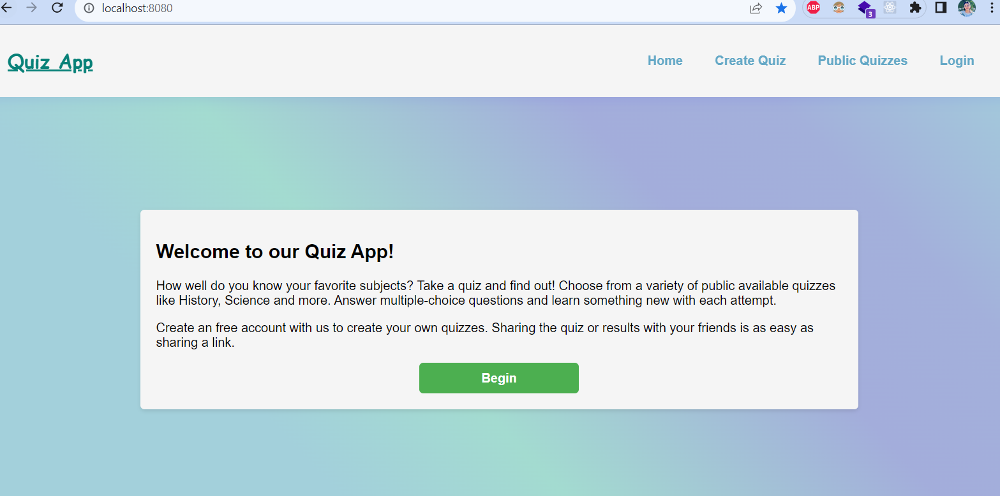
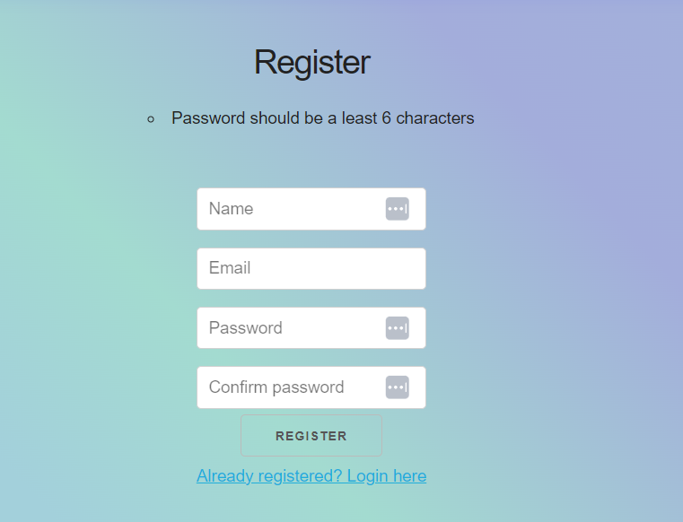
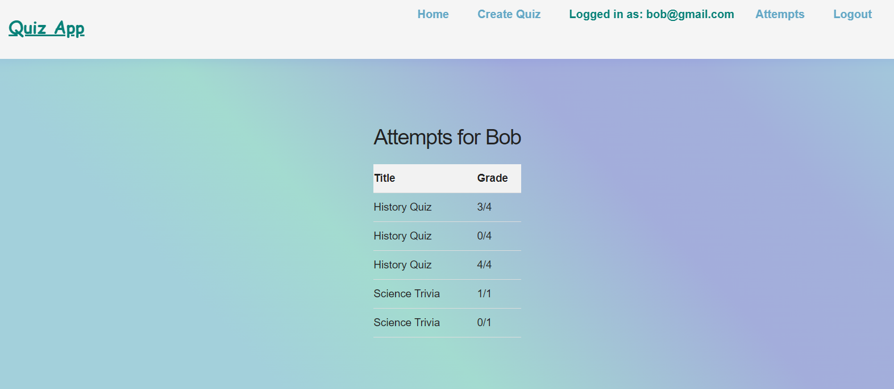
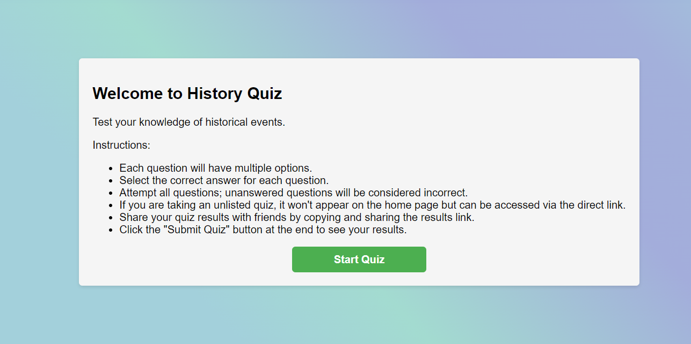

# QuizMaster: Unleash the Quizzing Awesomeness 🚀
Welcome to QuizMaster, your go-to app for creating, sharing, and conquering quizzes with friends! Tired of mundane quizzes? Spice it up with QuizMaster and make quizzing an experience.

## Tech Stack
- NodeJS
- Express (RESTful routes)
- SASS
- PostgreSQL and pg
- PostgreSQL

## Features at a Glance 🌟
- Create Quizzes: Craft quizzes that challenge the intellect or tickle the funny bone. The power is in your hands!

- Privacy Matters: Make your quizzes exclusive by setting them as unlisted. Share only with those in the know, or keep them a secret masterpiece.

- Shareable Links: Easily share a link to your thought-provoking quiz with your friends. The more, the merrier!

- Discover Public Quizzes: Explore a plethora of public quizzes on the home page. There's always something new to learn or laugh about.

- Attempt Quizzes: Dive into the quiz ocean! Take on quizzes created by others and showcase your knowledge.

- Results Galore: See the results of your recent attempts and share them with pride!

## Quick Setup Steps
- Create .env: Use the .env.example as your magical guide: cp .env.example .env

- Update .env: Populate it with your local secrets. Because sharing is not always caring in the digital world.

- Install Dependencies: npm i – because even QuizMaster needs its fuel.

- Fix Sass Binaries: A touch of magic – npm rebuild node-sass.

- Reset the Database: npm run db:reset – because databases need a reset button too.

- Launch the Server: npm run local – and voila, the quiz kingdom is ready at http://localhost:8080/.

## Final Product

## Dependencies 🧙‍♂️
Node 10.x or above
NPM 5.x or above
PG 6.x
Now go forth, QuizMaster, and let the quizzing extravaganza begin! May the correct answers be ever in your favor. 🚀🎉